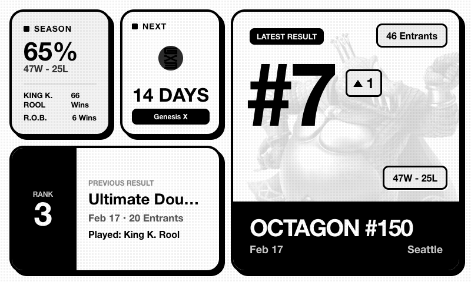

# TRMNL Smash Plugin

A lightweight integration that brings your **Super Smash Bros. Ultimate** tournament performance from [Start.gg](https://start.gg) directly to your **TRMNL** e-ink display.


## Dashboard Preview



## Features

- **Season Stats:** Game win rate, W/L record, and your top 2 most-played characters with stock icons.
- **Next Tournament:** Countdown (in days) to your next registered Start.gg event with tournament logo.
- **Latest Result:** Placement, upset factor (seed vs. result), entrant count, character played, and tournament details.
- **Previous Result:** Placement and details from your second-most-recent event for quick comparison.
- **Auto-Discovery:** Uses your Start.gg API token to automatically identify your account — no slugs or IDs needed.
- **Periodic Updates:** Configurable polling interval (default: 60 min) to keep your TRMNL device up to date.
- **E-ink Optimized:** High-contrast, grayscale layout designed for the TRMNL 800x480 display.

## Data Points

The following data is pushed to your TRMNL device via webhook:

| Section | Key | Description |
| :--- | :--- | :--- |
| **Gamertag** | `user.gamerTag` | Your Start.gg player tag |
| **Win Rate** | `season.win_rate` | Overall game win percentage |
| **Record** | `season.wins` / `season.losses` | Total games won and lost |
| **Top Characters** | `season.top_chars` | Your 2 most-played characters (name, usage count, stock icon URL) |
| **Next Tournament** | `next_tournament.name` | Name of your next registered event |
| **Days Remaining** | `next_tournament.days_remaining` | Countdown in days |
| **Latest Rank** | `latest_result.rank` | Placement at your most recent event |
| **Upset Factor** | `latest_result.upset_factor` | Seed vs. placement performance (positive = outperformed seed) |
| **Entrants** | `latest_result.entrants` | Number of entrants in the event |
| **Character Played** | `latest_result.char_played` | Most-played character at that event |
| **Event Name** | `latest_result.event_name` | Specific event bracket name |
| **Tournament Name** | `latest_result.tournament_name` | Parent tournament name |
| **Date** | `latest_result.date` | Formatted event date |
| **Location** | `latest_result.location` | City or "Online" |
| **Event Record** | `latest_result.wins` / `latest_result.losses` | Set wins and losses at this event |
| **Character Icon** | `latest_result.char_image_url` | Stock icon URL for the character played |
| **Previous Rank** | `previous_result.rank` | Placement at the event before that |
| **Previous Details** | `previous_result.*` | Same fields as latest result (upset_factor, event_name, etc.) |
| **Next Tournament Image** | `next_tournament.image_url` | Tournament profile image URL |
| **User Images** | `user.images` | Array of Start.gg profile images |

## Setup Instructions

### 1. Start.gg Developer Setup
1. Visit the [Start.gg Developer Portal](https://start.gg/admin/profile/developer).
2. Generate a new **API Token**.
3. The token automatically identifies your account — no separate user slug or player ID is needed.

### 2. TRMNL Setup
1. Log in to your [TRMNL Dashboard](https://usetrmnl.com/).
2. Navigate to **Plugins** > **Private Plugins**.
3. Create a new plugin using the **Webhook** strategy.
4. Copy your unique **Webhook URL**.
5. Copy the code from `trmnl_template.liquid` into the **Liquid Template** section of your plugin.

### 3. Installation & Configuration
1. Clone this repository:
   ```bash
   git clone https://github.com/YOUR_USERNAME/trmnl-smash-plugin.git
   cd trmnl-smash-plugin
   ```
2. Install dependencies:
   ```bash
   npm install
   ```
3. Configure your environment:
   ```bash
   cp .env.example .env
   ```
4. Fill in the `.env` file:
   - `STARTGG_TOKEN` — Your Start.gg API token
   - `TRMNL_WEBHOOK_URL` — Your TRMNL webhook URL
   - `REFRESH_INTERVAL_MINUTES` — Polling interval in minutes (default: 60)
   - `PORT` — Health check server port (default: 8080)

### 4. Local Preview
Generate a preview of the dashboard with mock data:
```bash
npm run preview
```
Open `preview.html` in your browser to verify the design before deploying.

### 5. Running the Plugin
Build and start the polling service:
```bash
npm run build
npm start
```

For development with auto-reload:
```bash
npm run dev
```

## Deployment Options

This project includes a minimal HTTP server for health checks, making it suitable for cloud deployment.

### Azure App Service (Recommended)

1. **Create an App Service** (Linux, Node.js runtime).
2. **Set Environment Variables** in the Azure Portal under Configuration > Application settings.
3. **Deploy** via VS Code Azure extension or GitHub Actions.
   - The app listens on `PORT` (default 8080) for health checks.
   - It runs the Start.gg fetch loop in the background.
4. **Enable Always On** (Basic B1 tier or higher) so the background timer never sleeps.

### Other Options
- **Home Server / Raspberry Pi:** Run with `pm2 start dist/index.js` for a simple always-on setup.
- **Any Node.js host:** The health check server on `PORT` makes this compatible with most PaaS providers.

## Project Structure

```
src/
  index.ts                    # Main entry point, polling loop, and health check server
  providers/
    startgg.ts                # Start.gg GraphQL client and data processing
    startgg.types.ts          # Provider-specific TypeScript interfaces
  queries/                    # GraphQL query definitions (user, tournaments, sets)
  gql/graphql.ts              # Auto-generated GraphQL types (via codegen)
  data/smash-characters.json  # Character data (IDs, names, icon URLs)
  trmnl.ts                    # TRMNL webhook client
  preview.ts                  # Local preview generator using mock data
  characters.ts               # Smash character ID-to-name/icon mapping
  types.ts                    # TypeScript type definitions
  utils.ts                    # Date formatting and countdown helpers
  constants.ts                # API URL and game ID constants
trmnl_template.liquid         # Liquid template for the TRMNL e-ink display
```

## License
MIT
